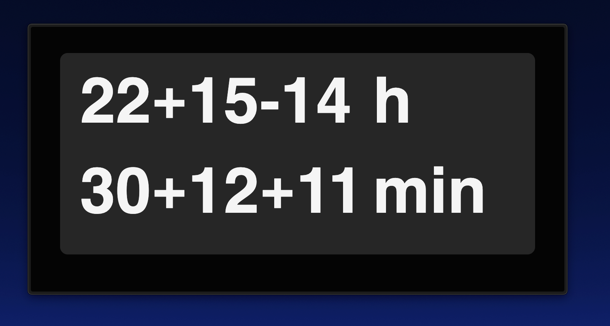

# ⏰️ Math clock

A small website that displays the current time as mathematical expressions instead of regular digits. 

## Features

- Updates every minute with new math problems
- Uses addition, subtraction, multiplication and division
- Numbers will not become too large, don't worry :)

## Quick Start

### Using Docker Compose

If you want to run this permanently, you can use Docker for this.

Clone the repository.

```bash
git clone https://github.com/jonahkraft/mathclock.git
cd mathclock
```

The default port is `3000`. You can adjust this by changing the `docker-compose.yml` file:

```yaml
ports:
  - "YOUR_PORT:80"
```

Then start the application.
```bash
docker-compose up -d
```

Access the application at `http://localhost:3000`

### Without Docker

Clone the repository or download the files als zip.

```bash
git clone https://github.com/jonahkraft/mathclock.git
```

Then simply open `index.html` with your browser.

## Preview



## Credits

Favicon from [SVG Repo](https://www.svgrepo.com/svg/502586/clock) (Public Domain)