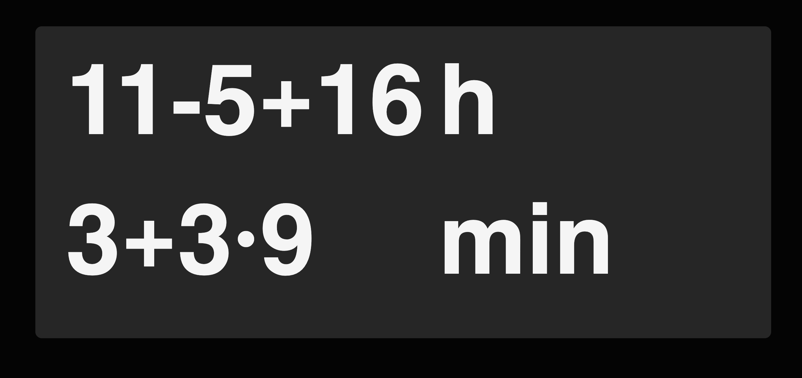

# MathClock

A fun web app that displays the current time as mathematical expressions instead of regular digits. Instead of showing `17:32`, you might see `7×2+3:2*17-2`!



## 🌐 Live Demo

Try it out: **[jonahkraft.github.io/mathclock](https://jonahkraft.github.io/mathclock/)**

## ✨ Features

- Updates every minute with new math problems
- Uses addition, subtraction, multiplication, and division
- No dependencies - pure HTML, CSS, and JavaScript

## 🚀 Quick Start

### Using Docker Compose (Recommended)

```bash
# Clone the repository
git clone https://github.com/jonahkraft/mathclock.git
cd mathclock

# Start the application
docker-compose up -d

# Access the application at http://localhost:3001
```

### Manual Docker Build

```bash
# Clone the repository
git clone https://github.com/jonahkraft/mathclock.git
cd mathclock

# Build the image
docker build -t mathclock .

# Run the container
docker run -d -p 3001:80 mathclock
```

### Without Docker

```bash
# Clone the repository
git clone https://github.com/jonahkraft/mathclock.git
cd mathclock

# Simply open index.html in your browser - no build process or server required
open index.html
```

## ⚙️ Configuration

Change the port by modifying `docker-compose.yml`:

```yaml
ports:
  - "YOUR_PORT:80"
```

## 📝 Credits

Favicon from [SVG Repo](https://www.svgrepo.com/svg/502586/clock) (Public Domain)